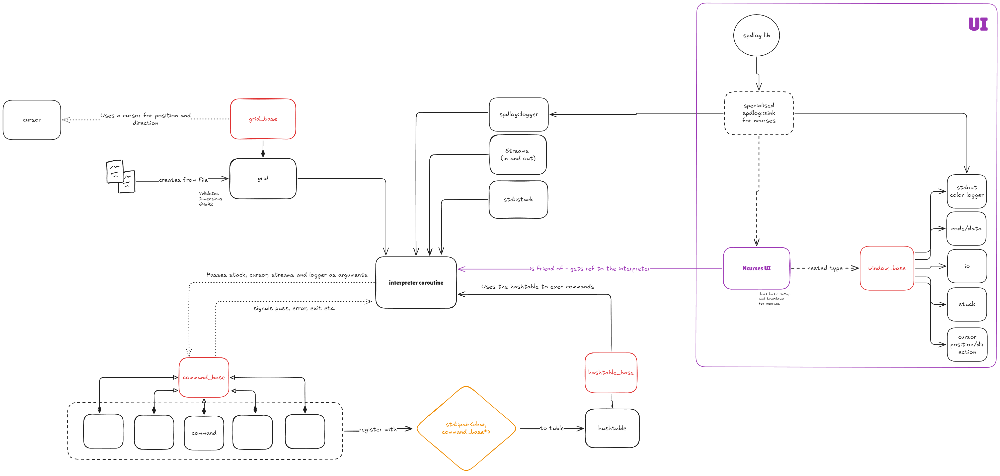

# Building

This project uses conan to install some libraries. For some reason, the profile __needs to declare the gcc compiler__ as compiling ncurses with clang did not work. You may later tell cmake to build the project with clang etc., this is just necessary for installing ncurses. Please also make sure you have make, cmake and conan installed before attempting to install. 
For example, these were my settings for the conan profile:

```sh
[settings]
arch=x86_64
build_type=Release
compiler=gcc # gcc necessary for ncurses
compiler.cppstd=gnu17
compiler.libcxx=libstdc++11
compiler.version=13
os=Linux

```

Then install the libraries with conan and compile using cmake.
The binary will be located in either `build/Release/` or `build/Debug/` depending on the `build_type` setting chosen in the conan profile.

```sh
# autodetect conan profile
conan profile detect # --name=<profile_name> optional

# in project root directory
conan install . --build=missing # --profile=<profile_name> optional

# build project
cmake --preset conan-release
cmake --build --preset conan-release
```

If you run into an issue with ncurses/running the binary outputting something like `Error opening terminal: [...]`, try installing the `ncurses-term` database and setting some env-variables:

```sh
apt install ncurses-term

export TERMINFO=/usr/share/terminfo
```

# Model

The picture below shows the rough model of how the classes are implemented to work with each other. Note that this was my first sketch and therefore does not hold true to the full extend, but most parts are implemented this way.



## Commands, grid and hashtable

A grid-class takes the data of a file as input and provides a cursor to move around the stack-allocated grid in the object.  
Each command-char is implemented in its own `std::function` object. The callables for the commands are registered to a hashtable, which itself is plugged into the interpreter coroutine (passed by reference).

## Interpreter coroutine

The interpreter class takes a hashtable with the commands and the grid. Additionally, it takes an input- and outputstream by reference and a stack and a spdlog::logger for logging stuff. The design aims to maximise testablity. In 'production', a custom `std::streambuf` is used to route the inputs and outputs to the ncurses windows (stdin and stdout does not work). The logger itself has a similar sink which prints to a window.

I chose to use a coroutine as the UI depends on small stops in the execution in order to show intermediate steps to the user. Also, I wanted to use them (lol). The coroutine keeps the logic contained and there is no need to add a `this_thread::sleep_for` anywhere in the interpreter logic directly. This is done in the loop in main. I've also implemented *stepping* capablities like in GDB: the loop in main checks for input non-blockingly. If 'n' is pressed, the iterations depend on user input (subsequent 'n's) and when 'c' is pressed, the loop will continue to run with the timer again.

## UI

I tried to keep the interface between the logic-handling stuff and the frontend as minimal as possible (like with the coro). Also, gtest did not like being linked against ncurses library at all, so I had to split the ui stuff into src/ui and include/ui. The UI consists of a global object which sets up ncurses (and does some cleanup as well), the logger's sink and custom streambuf mentioned before and some`ui::operators` as I call them, which are derivatives of the interface `ui::OperatorBase` and implement a render method which takes the interpreter object as reference and prints its internals to the windows. Some classes provide public methods to provide access to their private members. Originally I intended to friend a bunch of classes, but I then had to deal with a lot of cyclic includes...

## Testing

Oh forget it, I stopped testing pretty soon. The logic is pretty simple, each class doesn't have much code and all the commands are actually just two lines of doing something and the rest is boilerplate error prevention. Nevertheless, I have no confidence in that everything works and is bug-free. Testing for memory-leaks with valgrind had a weird outpu: as ncurses allocates some stuff in the background, some bytes are 'possibly lost', but nothings 'definitely lost'. 